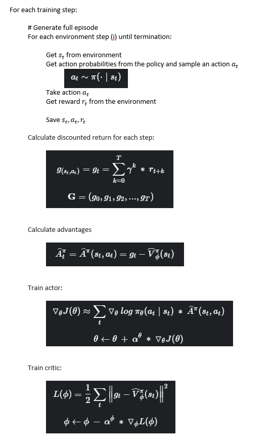
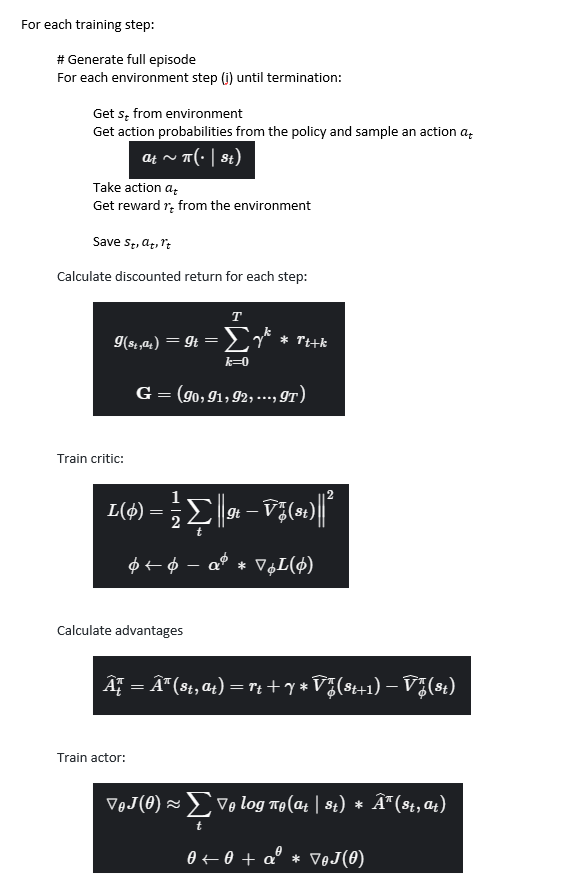

# Actor-Critic methods for Reinforcement Learning

This repository contains my own implementations of different actor-critic 
methods. It uses [Weights&Biases](https://wandb.ai/) 
for training statistics and visualizations.

Available implementations:
 - [REINFORCE with Critic as Baseline](#reinforce-with-baseline)
 - [Batch Actor-Critic](#batch-actor-critic)
 - [Online Actor-Critic](#implemented-algorithms)
 - [Advantage Actor-Critic (A2C)](#implemented-algorithms)


There is an interface to add environments to train the agents.
At this moment it has the environments:
 - [CartPole-v0](https://gym.openai.com/envs/CartPole-v1/)
 - [FlappyBird](https://pygame-learning-environment.readthedocs.io/en/latest/user/games/flappybird.html)
 
## Usage

### Dependencies
Install all needed packages with:
```
pip install -r requirements.txt
```
 
### Train agent
To train a new agent to play one of the available environments, use the 
script `train_agent.py`. The experiment configuration is passed as a 
`.json` file. The `configurations` folder has files with the best set of 
hyperparameters I found for each agent and environment.

Here is an example to train a Batch Actor-Critic agent on CartPole with 
default configurations:

```
python train_agent.py --config_file configurations/cart_pole_batchAC.json
```

To use new configurations just change the values of the file you are using, 
or create a copy with different values and pass it to the script.
The trained agent files are saved by default in an `experiments` folder 
inside this project.

To see all the script options use:


```
python train_agent.py -h
```

### Test agent
To test a trained agent on the environment, use the 
script `test_agent.py`. You can watch the agent playing with the 
`--render_games` flag.

Here is an example to test and watch a trained agent for CartPole located in 
`experiments/cart_pole_batchAC_default` for 10 episodes:

```
python test_agent.py --experiment_dir experiments/cart_pole_batchAC_default --episodes 10 --render_games
```

## Implemented algorithms

### REINFORCE with baseline



### Batch Actor-Critic




## Sources
 - http://rail.eecs.berkeley.edu/deeprlcourse/static/slides/lec-6.pdf
 - https://www.tensorflow.org/tutorials/reinforcement_learning/actor_critic
 - http://incompleteideas.net/sutton/book/RLbook2018.pdf
 - https://github.com/ntasfi/PyGame-Learning-Environment
 - https://gym.openai.com/
