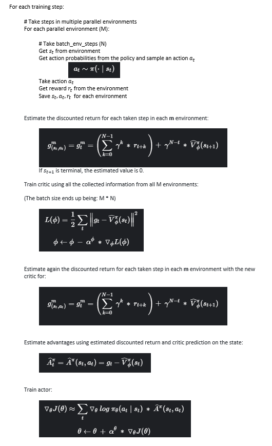

# Actor-Critic methods for Reinforcement Learning


This repository contains my own implementations of different actor-critic 
methods. It uses [Weights&Biases](https://wandb.ai/) 
for training statistics and visualizations. For long experiments, the statistics file 
saved can get very big in memory size.


|  |  |
| :------: | :------: | 
| *Trained agent playing CartPole*    | *Trained agent playing FlappyBird* |


*Trained agent playing CartPole*


*Trained agent playing FlappyBird*

Available implementations:
 - [REINFORCE with Critic as Baseline](#reinforce-with-baseline)
 - [Batch Actor-Critic](#batch-actor-critic)
 - [Online Actor-Critic](#implemented-algorithms)
 - [Advantage Actor-Critic (A2C)](#implemented-algorithms)


There is an interface to add environments to train the agents.
At this moment it has:
 - [CartPole-v0](https://gym.openai.com/envs/CartPole-v1/)
 - [FlappyBird](https://pygame-learning-environment.readthedocs.io/en/latest/user/games/flappybird.html)
 
## Usage

### Dependencies
Install all needed packages with:
```
pip install -r requirements.txt
```
 
### Train agent
To train a new agent to play one of the available environments, use the 
script `train_agent.py`. The experiment configuration is passed as a 
`.json` file. The `configurations` folder has files with the best set of 
hyperparameters I found for each agent and environment.

Here is an example to train a Batch Actor-Critic agent on CartPole with 
default configurations:

```
python train_agent.py --config_file configurations/cart_pole_batchAC.json
```

To use new configurations just change the values of the file you are using, 
or create a copy with different values and pass it to the script.
The trained agent files are saved by default in an `experiments` folder 
inside this project.

To see all the script options use:


```
python train_agent.py -h
```

### Test agent
To test a trained agent on the environment, use the 
script `test_agent.py`. You can watch the agent playing with the 
`--render_games` flag.

Here is an example to test and watch a trained agent for CartPole located in 
`experiments/cart_pole_batchAC` for 10 episodes:

```
python test_agent.py --experiment_dir experiments/cart_pole_batchAC --episodes 10 --render_games
```

### Visualize agent progress during learning

By default, the agents stores the state of itself 20 times during 
the complete training process. The script `animated_progress.py` shows the 
agent playing a game one time for each saved state. It lets you visualize 
how the agent makes progress in trying to solve the current task.

Here is an example to visualize the progress of an agent for CartPole located in 
`experiments/cart_pole_batchAC`:

```
python animated_progress.py --experiment_dir experiments/cart_pole_batchAC
```

## Trained agents

Here are my experiments best results for each environment and agent type.
The experiment duration is on my MSI GeForce RTX 2060 SUPER, for a time reference frame.

| Experiment name                   | End step | Training time | Test mean reward |
| --------------------------------- | :------: | :-----------: | :--------------: |
| cart\_pole\_REINFORCE\_05         | 131      | 31s           | 193,58           |
| cart\_pole\_batchAC\_06           | 836      | 1m 2s         | 200              |
| cart\_pole\_onlineAC\_default\_05 | 20.000   | 4m 36s        | 193,369          |
| cart\_pole\_A2C\_default\_02      | 1.250    | 1m 12s        | 173,279          |
| flappybird\_REINFORCE\_04         | 13.265   | 48m 59s       | 7,29             |
| flappybird\_batchAC\_06           | 44.590   | 2h 35m 34     | 7,58             |
| flappybird\_onlineAC\_04          | 555.347  | 2h 53m 4s     | 5,33             |
| flappybird\_A2C\_02               | 7.500    | 35m 48s       | 7,26             |

The mean test reward is running the agent for 100 episodes. For FlappyBird a perfect score 
is 10, for CartPole is 200.

Here are all the experiments for each environment. You can download and visualize them using 
the scripts:
 - [CartPole](https://drive.google.com/file/d/1Nb9xHTl7GFj4r8IgEr4av7N_WtmvYVcu/view?usp=sharing)
 - [FlappyBird](https://drive.google.com/file/d/118FJj_CJGaGvbv4xj2PgA0vCnWbueuM2/view?usp=sharing)

## Implemented algorithms

### REINFORCE with baseline


### Batch Actor-Critic


### Online Actor-Critic


### Advantage Actor-Critic (A2C)




## Sources
 - http://rail.eecs.berkeley.edu/deeprlcourse/static/slides/lec-6.pdf
 - https://www.tensorflow.org/tutorials/reinforcement_learning/actor_critic
 - http://incompleteideas.net/sutton/book/RLbook2018.pdf
 - https://github.com/ntasfi/PyGame-Learning-Environment
 - https://gym.openai.com/
